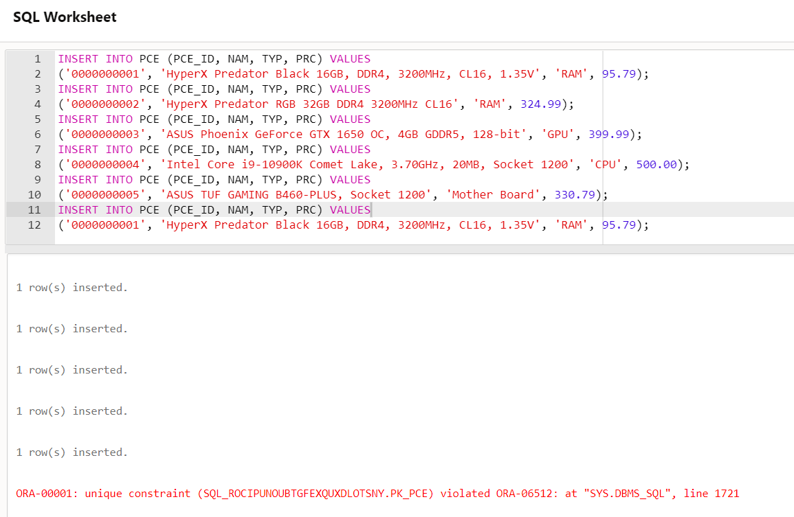

## Table of Contents

- [Lab 01](#lab-01)
  - [Ownership](#ownership)
  - [Course](#course)
    - [XCASE Diagram](#xcase-diagram)
    - [SQL Script](#sql-script)
  - [Lab](#lab)
    - [XCASE Diagram](#xcase-diagram-1)
    - [Legend](#legend)
    - [SQL Script](#sql-script-1)
    - [Data insert and contraint testing](#data-insert-and-contraint-testing)
      - [Distributor](#distributor)
        - [Insert Commands](#insert-commands)
        - [Insert Commands Results](#insert-commands-results)
        - [Select Results](#select-results)
        - [Testing scenario](#testing-scenario)
      - [Piece](#piece)
        - [Insert Commands](#insert-commands-1)
        - [Insert Commands Results](#insert-commands-results-1)
        - [Select Results](#select-results-1)
        - [Testing scenario](#testing-scenario-1)
      - [Computer](#computer)
        - [Insert Commands](#insert-commands-2)
        - [Insert Commands Results](#insert-commands-results-2)
        - [Select Results](#select-results-2)
        - [Testing scenario](#testing-scenario-2)
      - [Testing the View](#testing-the-view)


# Lab 01
## Ownership
- Student: Marius Vintila
- Group: 341C5

---
## Course
### XCASE Diagram

### SQL Script
```sql
CREATE  TABLE Studenti
( 
     Matricol NUMBER(5) NOT NULL ,
     Nume VARCHAR2(50) NULL ,
     Cnp VARCHAR2(15) NULL ,
     Data_nastere DATE NULL ,
     Adresa VARCHAR2(50) NULL ,
     Telefon VARCHAR2(10) NULL      ,
     CONSTRAINT PK_Studenti PRIMARY KEY (Matricol) NOT DEFERRABLE Initially IMMEDIATE
     USING INDEX
     PCTFREE 10
     INITRANS 2
     MAXTRANS 255
     STORAGE
     (
       INITIAL 64K
       NEXT 0K
       MINEXTENTS 1
       MAXEXTENTS 2147483645
       PCTINCREASE 0
     )
)
     PCTFREE 10
     PCTUSED 40
     INITRANS 1
     MAXTRANS 255
     STORAGE
     (
       INITIAL 64K
       NEXT 0K
       MINEXTENTS 1
       MAXEXTENTS 2147483645
       PCTINCREASE 0
     )
/

CREATE  TABLE Comp_grupe
( 
     Cod_grupa VARCHAR2(5) NOT NULL ,
     Seria VARCHAR2(5) NOT NULL ,
     An_univ VARCHAR2(10) NOT NULL ,
     Matricol NUMBER(5) NOT NULL ,
     Restantier VARCHAR2(2) NULL ,
     Obs VARCHAR2(50) NULL      ,
     CONSTRAINT PK_Comp_grupe PRIMARY KEY (Cod_grupa,Seria,An_univ,Matricol) NOT DEFERRABLE Initially IMMEDIATE
     USING INDEX
     PCTFREE 10
     INITRANS 2
     MAXTRANS 255
     STORAGE
     (
       INITIAL 64K
       NEXT 0K
       MINEXTENTS 1
       MAXEXTENTS 2147483645
       PCTINCREASE 0
     )
)
     PCTFREE 10
     PCTUSED 40
     INITRANS 1
     MAXTRANS 255
     STORAGE
     (
       INITIAL 64K
       NEXT 0K
       MINEXTENTS 1
       MAXEXTENTS 2147483645
       PCTINCREASE 0
     )
/

CREATE  TABLE Inmatriculari
( 
     Matricol NUMBER(5) NOT NULL ,
     An_univ VARCHAR2(10) NOT NULL ,
     An_studio NUMBER(1) NULL ,
     Seria VARCHAR2(5) NULL ,
     Cod_grupa VARCHAR2(5) NULL ,
     Taxa VARCHAR2(2) NULL      ,
     CONSTRAINT PK_Inmatriculari PRIMARY KEY (Matricol,An_univ) NOT DEFERRABLE Initially IMMEDIATE
     USING INDEX
     PCTFREE 10
     INITRANS 2
     MAXTRANS 255
     STORAGE
     (
       INITIAL 64K
       NEXT 0K
       MINEXTENTS 1
       MAXEXTENTS 2147483645
       PCTINCREASE 0
     )
)
     PCTFREE 10
     PCTUSED 40
     INITRANS 1
     MAXTRANS 255
     STORAGE
     (
       INITIAL 64K
       NEXT 0K
       MINEXTENTS 1
       MAXEXTENTS 2147483645
       PCTINCREASE 0
     )
/

CREATE  TABLE Grupe
( 
     Cod_grupa VARCHAR2(5) NOT NULL ,
     Seria VARCHAR2(5) NOT NULL ,
     An_studiu NUMBER(1) NULL      ,
     CONSTRAINT PK_Grupe PRIMARY KEY (Cod_grupa,Seria) NOT DEFERRABLE Initially IMMEDIATE
     USING INDEX
     PCTFREE 10
     INITRANS 2
     MAXTRANS 255
     STORAGE
     (
       INITIAL 64K
       NEXT 0K
       MINEXTENTS 1
       MAXEXTENTS 2147483645
       PCTINCREASE 0
     )
)
     PCTFREE 10
     PCTUSED 40
     INITRANS 1
     MAXTRANS 255
     STORAGE
     (
       INITIAL 64K
       NEXT 0K
       MINEXTENTS 1
       MAXEXTENTS 2147483645
       PCTINCREASE 0
     )
/

ALTER TABLE Comp_grupe ADD
(
     CONSTRAINT FK_grupe_comp FOREIGN KEY
     ( Cod_grupa , Seria )
     REFERENCES Grupe
     ( Cod_grupa , Seria )
     NOT DEFERRABLE Initially IMMEDIATE
)
/

ALTER TABLE Inmatriculari ADD
(
     CONSTRAINT FK_stud_inmatr FOREIGN KEY
     ( Matricol )
     REFERENCES Studenti
     ( Matricol )
     NOT DEFERRABLE Initially IMMEDIATE
)
/

CREATE OR REPLACE FORCE VIEW V_stud_taxa
AS SELECT ALL  Inmatriculari.An_univ ,  Inmatriculari.Cod_grupa ,  Inmatriculari.Matricol ,  
       Inmatriculari.Seria 
   FROM  Inmatriculari Inmatriculari 
   WHERE Inmatriculari.An_univ='2020/2021' and Inmatriculari.Taxa='DA'
/


```
---
## Lab
I chose to use a standard that removes vowels from table and field names; Personal preference. I would've also added some lookup tables for certain values but the restriction was of only 3 tables, so I'll have to populate the tables with repeated values
### XCASE Diagram

### Legend
- DSTRBTR - Distributor
- NAM - Name
- ADDR_LIN - Address Line
- CTRY_CD - Country Code
- CMPTR - Computer
- PCE - Piece
- MTHR_BRD - Mother Board
- TYP - Type
- PRC - Price
### SQL Script
```sql
CREATE  TABLE DSTRBTR
( 
     DSTRBTR_ID VARCHAR2(5) NOT NULL ,
     NAM VARCHAR2(50) NULL ,
     ADDR_LIN_1 VARCHAR2(50) NULL ,
     ADDR_LIN_2 VARCHAR2(50) NULL ,
     CTRY_CD VARCHAR2(3) NULL      ,
     CONSTRAINT PK_DSTRBTR PRIMARY KEY (DSTRBTR_ID) NOT DEFERRABLE Initially IMMEDIATE
     USING INDEX
     PCTFREE 10
     INITRANS 2
     MAXTRANS 255
     STORAGE
     (
       INITIAL 64K
       NEXT 0K
       MINEXTENTS 1
       MAXEXTENTS 2147483645
       PCTINCREASE 0
     )
)
     PCTFREE 10
     PCTUSED 40
     INITRANS 1
     MAXTRANS 255
     STORAGE
     (
       INITIAL 64K
       NEXT 0K
       MINEXTENTS 1
       MAXEXTENTS 2147483645
       PCTINCREASE 0
     )
/
```
```sql
CREATE  TABLE CMPTER
( 
     CMPTR_ID VARCHAR2(10) NOT NULL ,
     DSTRBTR_ID VARCHAR2(5) NOT NULL ,
     CPU_PCE_ID VARCHAR2(10) NULL ,
     GPU_PCE_ID VARCHAR2(10) NULL ,
     RAM_1_PCE_ID VARCHAR2(10) NULL ,
     RAM_2_PCE_ID VARCHAR2(10) NULL ,
     MTHR_BRD_PCE_ID VARCHAR2(10) NULL      ,
     CONSTRAINT PK_CMPTER PRIMARY KEY (CMPTR_ID,DSTRBTR_ID) NOT DEFERRABLE Initially IMMEDIATE
     USING INDEX
     PCTFREE 10
     INITRANS 2
     MAXTRANS 255
     STORAGE
     (
       INITIAL 64K
       NEXT 0K
       MINEXTENTS 1
       MAXEXTENTS 2147483645
       PCTINCREASE 0
     )
)
     PCTFREE 10
     PCTUSED 40
     INITRANS 1
     MAXTRANS 255
     STORAGE
     (
       INITIAL 64K
       NEXT 0K
       MINEXTENTS 1
       MAXEXTENTS 2147483645
       PCTINCREASE 0
     )
/
```
```sql
CREATE  TABLE PCE
( 
     PCE_ID VARCHAR2(10) NOT NULL ,
     NAM VARCHAR2(100) NULL ,
     TYP VARCHAR2(30) NULL ,
     PRC FLOAT(10) NULL      ,
     CONSTRAINT PK_PCE PRIMARY KEY (PCE_ID) NOT DEFERRABLE Initially IMMEDIATE
     USING INDEX
     PCTFREE 10
     INITRANS 2
     MAXTRANS 255
     STORAGE
     (
       INITIAL 64K
       NEXT 0K
       MINEXTENTS 1
       MAXEXTENTS 2147483645
       PCTINCREASE 0
     )
)
     PCTFREE 10
     PCTUSED 40
     INITRANS 1
     MAXTRANS 255
     STORAGE
     (
       INITIAL 64K
       NEXT 0K
       MINEXTENTS 1
       MAXEXTENTS 2147483645
       PCTINCREASE 0
     )
/
```
```sql
ALTER TABLE CMPTER ADD
(
     CONSTRAINT FK_DSTRBTR_CMPTER FOREIGN KEY
     ( DSTRBTR_ID )
     REFERENCES DSTRBTR
     ( DSTRBTR_ID )
     NOT DEFERRABLE Initially IMMEDIATE
)
/
```
```sql
ALTER TABLE CMPTER ADD
(
     CONSTRAINT FK_PCE_CPU FOREIGN KEY
     ( CPU_PCE_ID )
     REFERENCES PCE
     ( PCE_ID )
     NOT DEFERRABLE Initially IMMEDIATE
)
/
```
```sql
ALTER TABLE CMPTER ADD
(
     CONSTRAINT FK_PCE_GPU FOREIGN KEY
     ( GPU_PCE_ID )
     REFERENCES PCE
     ( PCE_ID )
     NOT DEFERRABLE Initially IMMEDIATE
)
/
```
```sql
ALTER TABLE CMPTER ADD
(
     CONSTRAINT FK_PCE_RAM_1 FOREIGN KEY
     ( RAM_1_PCE_ID )
     REFERENCES PCE
     ( PCE_ID )
     NOT DEFERRABLE Initially IMMEDIATE
)
/
```
```sql
ALTER TABLE CMPTER ADD
(
     CONSTRAINT FK_PCE_RAM_2 FOREIGN KEY
     ( RAM_2_PCE_ID )
     REFERENCES PCE
     ( PCE_ID )
     NOT DEFERRABLE Initially IMMEDIATE
)
/
```
```sql
ALTER TABLE CMPTER ADD
(
     CONSTRAINT FK_PCE_MTHR FOREIGN KEY
     ( MTHR_BRD_PCE_ID )
     REFERENCES PCE
     ( PCE_ID )
     NOT DEFERRABLE Initially IMMEDIATE
)
/
```
```sql
CREATE OR REPLACE FORCE VIEW CMPTR_FULL_DTL
AS SELECT ALL  CMPTER.CMPTR_ID AS "Computer ID" ,  DSTRBTR.NAM AS "Distributor Name" ,  
       PCE.NAM AS "CPU Piece Name" ,  PCE_0.NAM AS "GPU Piece Name" ,  
       PCE_1.NAM AS "Ram 1 Piece Name" ,  PCE_2.NAM AS "Ram 2 Piece Name" ,  
       PCE_3.NAM AS "Mother Board Piece Name" 
   FROM  CMPTER CMPTER ,  DSTRBTR DSTRBTR ,  PCE PCE ,  PCE PCE_0 ,  
       PCE PCE_1 ,  PCE PCE_2 ,  PCE PCE_3 
   WHERE CMPTER.DSTRBTR_ID = DSTRBTR.DSTRBTR_ID 
    AND  CMPTER.CPU_PCE_ID = PCE.PCE_ID 
    AND  CMPTER.GPU_PCE_ID = PCE_0.PCE_ID 
    AND  CMPTER.RAM_1_PCE_ID = PCE_1.PCE_ID 
    AND  CMPTER.RAM_2_PCE_ID = PCE_2.PCE_ID 
    AND  CMPTER.MTHR_BRD_PCE_ID = PCE_3.PCE_ID 
   ORDER BY  "Distributor Name"  , "Computer ID"
/
```

### Data insert and contraint testing

#### Distributor
##### Insert Commands
```sql
insert into DSTRBTR (DSTRBTR_ID, NAM, ADDR_LIN_1, ADDR_LIN_2, CTRY_CD) VALUES
('00001', 'Asus', 'Beitou District, Taipei, Taiwan', NULL, 'TW');
insert into DSTRBTR (DSTRBTR_ID, NAM, ADDR_LIN_1, ADDR_LIN_2, CTRY_CD) VALUES
('00002', 'Kingston', 'Fountain Valley, California, Statele Unite', NULL, 'US');
insert into DSTRBTR (DSTRBTR_ID, NAM, ADDR_LIN_1, ADDR_LIN_2, CTRY_CD) VALUES
('00003', 'Intel', 'Santa Clara, California, Statele Unite', NULL, 'US');
insert into DSTRBTR (DSTRBTR_ID, NAM, ADDR_LIN_1, ADDR_LIN_2, CTRY_CD) VALUES
('00004', 'Nvidia', 'Santa Clara, California, Statele Unite', '2788 San Tomas Expressway Santa Clara, CA 95051', 'US');
insert into DSTRBTR (DSTRBTR_ID, NAM, ADDR_LIN_1, ADDR_LIN_2, CTRY_CD) VALUES
('00004', 'AMD', 'Santa Clara, California, Statele Unite', '2788 San Tomas Expressway Santa Clara, CA 95051', 'US');
```
##### Insert Commands Results

##### Select Results

##### Testing scenario
- Attempted to insert the same PK in another command

#### Piece
##### Insert Commands
```sql
INSERT INTO PCE (PCE_ID, NAM, TYP, PRC) VALUES
('0000000001', 'HyperX Predator Black 16GB, DDR4, 3200MHz, CL16, 1.35V', 'RAM', 95.79);
INSERT INTO PCE (PCE_ID, NAM, TYP, PRC) VALUES
('0000000002', 'HyperX Predator RGB 32GB DDR4 3200MHz CL16', 'RAM', 324.99);
INSERT INTO PCE (PCE_ID, NAM, TYP, PRC) VALUES
('0000000003', 'ASUS Phoenix GeForce GTX 1650 OC, 4GB GDDR5, 128-bit', 'GPU', 399.99);
INSERT INTO PCE (PCE_ID, NAM, TYP, PRC) VALUES
('0000000004', 'Intel Core i9-10900K Comet Lake, 3.70GHz, 20MB, Socket 1200', 'CPU', 500.00);
INSERT INTO PCE (PCE_ID, NAM, TYP, PRC) VALUES
('0000000005', 'ASUS TUF GAMING B460-PLUS, Socket 1200', 'Mother Board', 330.79);
INSERT INTO PCE (PCE_ID, NAM, TYP, PRC) VALUES
('0000000001', 'HyperX Predator Black 16GB, DDR4, 3200MHz, CL16, 1.35V', 'RAM', 95.79);
```
##### Insert Commands Results

##### Select Results

##### Testing scenario
- Attempted to insert the same PK in another command

#### Computer
##### Insert Commands
```sql
INSERT INTO CMPTER (CMPTR_ID, DSTRBTR_ID, CPU_PCE_ID, GPU_PCE_ID, RAM_1_PCE_ID, RAM_2_PCE_ID, MTHR_BRD_PCE_ID) VALUES
('0000000001', '00001', '0000000004', '0000000003', '0000000001', '0000000001', '0000000005');
INSERT INTO CMPTER (CMPTR_ID, DSTRBTR_ID, CPU_PCE_ID, GPU_PCE_ID, RAM_1_PCE_ID, RAM_2_PCE_ID, MTHR_BRD_PCE_ID) VALUES
('0000000001', NULL, '0000000004', '0000000003', '0000000001', '0000000001', '0000000005');
INSERT INTO CMPTER (CMPTR_ID, DSTRBTR_ID, CPU_PCE_ID, GPU_PCE_ID, RAM_1_PCE_ID, RAM_2_PCE_ID, MTHR_BRD_PCE_ID) VALUES
('0000000001', '00001', '0000000004', '0000000003', '0000000001', '0000000001', '0000000006');
```
##### Insert Commands Results


##### Select Results

##### Testing scenario
- Attempted to insert NULL in column part of PK
- Attempted to insert the same PK in another command
- Attempted to insert FK with inexisting value

#### Testing the View
