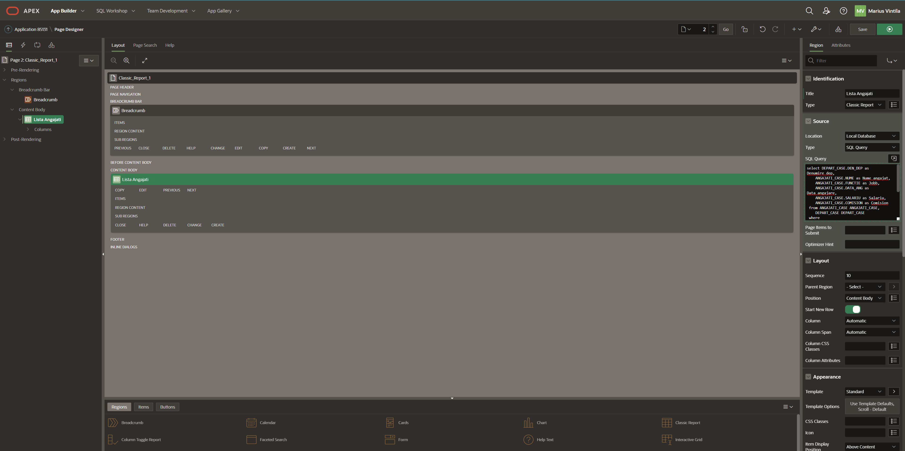
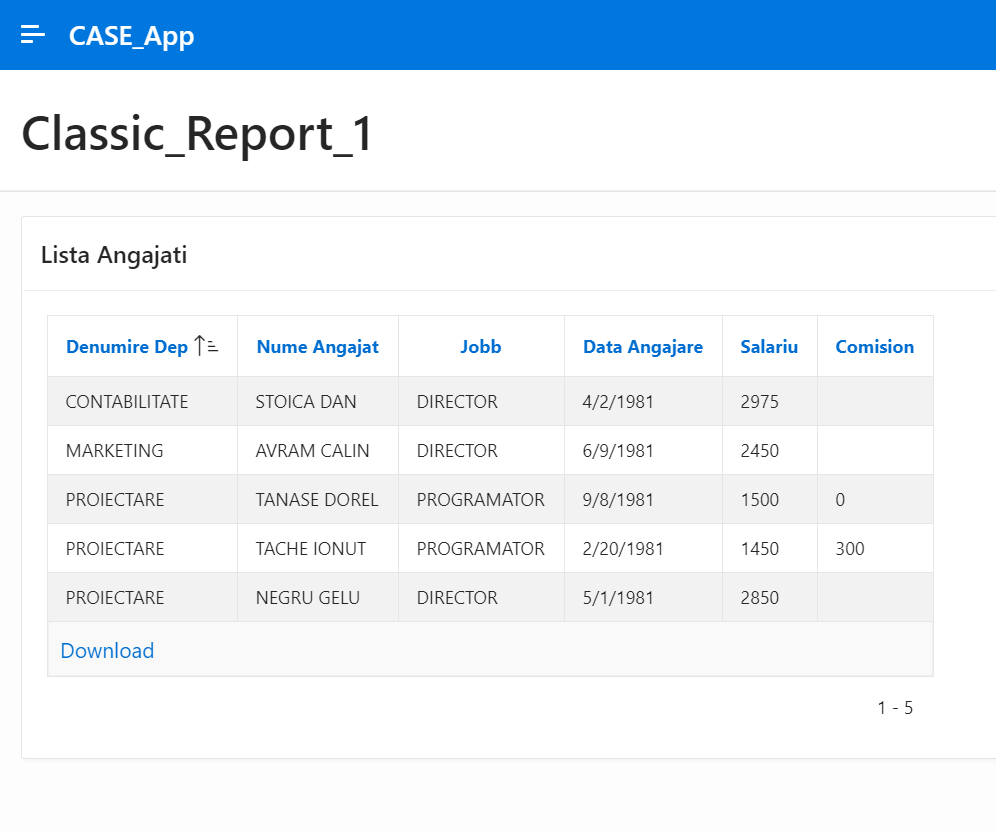
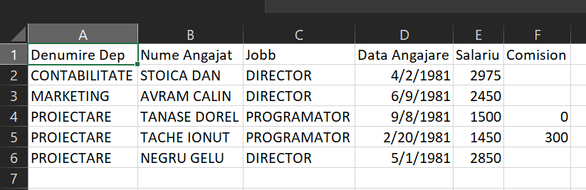
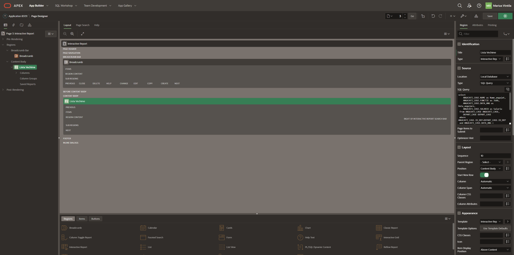
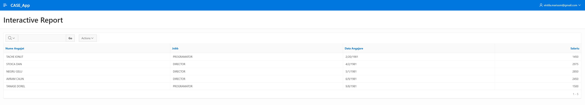
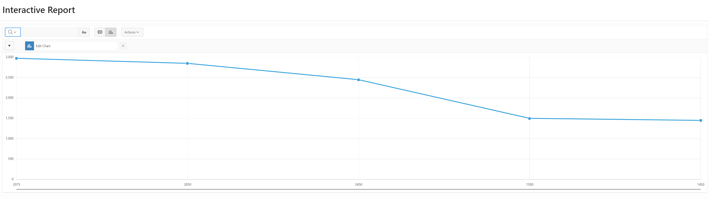
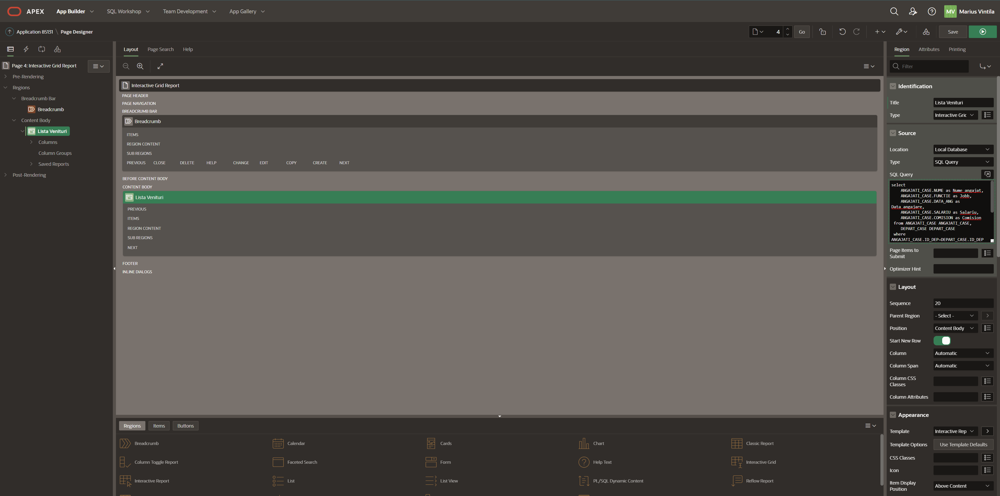
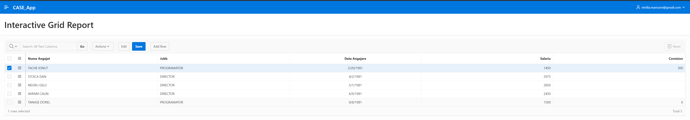
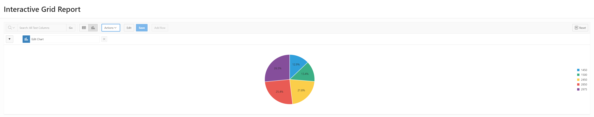

## Table of Contents

- [Lab 04](#lab-04)
  - [Ownership](#ownership)
  - [- Git URL for this lab](#--git-url-for-this-lab)
  - [**_NOTE_**: Please note that this repository is private. You need to provide me with your github account to provide you access.](#note-please-note-that-this-repository-is-private-you-need-to-provide-me-with-your-github-account-to-provide-you-access)
  - [Lab](#lab)
    - [Raport Clasic](#raport-clasic)
      - [Script](#script)
      - [Generare](#generare)
      - [Date](#date)
      - [Excel](#excel)
    - [Raport Interactiv](#raport-interactiv)
      - [Script](#script-1)
      - [Generare](#generare-1)
      - [Date](#date-1)
      - [Grafic](#grafic)
    - [Raport Interactiv Grid](#raport-interactiv-grid)
      - [Script](#script-2)
      - [Generare](#generare-2)
      - [Date](#date-2)
      - [Grafic](#grafic-1)


# Lab 04
## Ownership
- Student: Marius Vintila
- Group: 341C5
- [Git Repo](https://github.com/Mr-Vinti/SCAD_Labs)
- [Git URL for this lab](https://github.com/Mr-Vinti/SCAD_Labs/tree/master/04Lab)
---
**_NOTE_**: Please note that this repository is private. You need to provide me with your github account to provide you access.
---

---
## Lab

### Raport Clasic
#### Script
```sql
select DEPART_CASE.DEN_DEP as Denumire_dep,
    ANGAJATI_CASE.NUME as Nume_angajat,
    ANGAJATI_CASE.FUNCTIE as Jobb,
    ANGAJATI_CASE.DATA_ANG as Data_angajare,
    ANGAJATI_CASE.SALARIU as Salariu,
    ANGAJATI_CASE.COMISION as Comision
 from ANGAJATI_CASE ANGAJATI_CASE,
    DEPART_CASE DEPART_CASE 
 where ANGAJATI_CASE.ID_DEP=DEPART_CASE.ID_DEP
 and ANGAJATI_CASE.DATA_ANG <
    (SELECT ANGAJATI_CASE.DATA_ANG
    FROM ANGAJATI_CASE ANGAJATI_CASE
    WHERE ANGAJATI_CASE.ID_SEF IS NULL)
AND ANGAJATI_CASE.SALARIU >
    (SELECT ANGAJATI_CASE.SALARIU
    FROM ANGAJATI_CASE ANGAJATI_CASE
    WHERE ANGAJATI_CASE.ID_SEF IS NULL) / 4
```
#### Generare

#### Date

#### Excel


### Raport Interactiv
#### Script
```sql
select
    ANGAJATI_CASE.NUME as Nume_angajat,
    ANGAJATI_CASE.FUNCTIE as Jobb,
    ANGAJATI_CASE.DATA_ANG as Data_angajare,
    ANGAJATI_CASE.SALARIU as Salariu
 from ANGAJATI_CASE ANGAJATI_CASE,
    DEPART_CASE DEPART_CASE 
 where ANGAJATI_CASE.ID_DEP=DEPART_CASE.ID_DEP
 and ANGAJATI_CASE.DATA_ANG <
    (SELECT ANGAJATI_CASE.DATA_ANG
    FROM ANGAJATI_CASE ANGAJATI_CASE
    WHERE ANGAJATI_CASE.ID_SEF IS NULL)
AND ANGAJATI_CASE.SALARIU >
    (SELECT ANGAJATI_CASE.SALARIU
    FROM ANGAJATI_CASE ANGAJATI_CASE
    WHERE ANGAJATI_CASE.ID_SEF IS NULL) / 4
```
#### Generare

#### Date

#### Grafic



### Raport Interactiv Grid
#### Script
```sql
select
    ANGAJATI_CASE.NUME as Nume_angajat,
    ANGAJATI_CASE.FUNCTIE as Jobb,
    ANGAJATI_CASE.DATA_ANG as Data_angajare,
    ANGAJATI_CASE.SALARIU as Salariu,
    ANGAJATI_CASE.COMISION as Comision
 from ANGAJATI_CASE ANGAJATI_CASE,
    DEPART_CASE DEPART_CASE 
 where ANGAJATI_CASE.ID_DEP=DEPART_CASE.ID_DEP
 and ANGAJATI_CASE.DATA_ANG <
    (SELECT ANGAJATI_CASE.DATA_ANG
    FROM ANGAJATI_CASE ANGAJATI_CASE
    WHERE ANGAJATI_CASE.ID_SEF IS NULL)
AND ANGAJATI_CASE.SALARIU >
    (SELECT ANGAJATI_CASE.SALARIU
    FROM ANGAJATI_CASE ANGAJATI_CASE
    WHERE ANGAJATI_CASE.ID_SEF IS NULL) / 4
```
#### Generare

#### Date

#### Grafic

