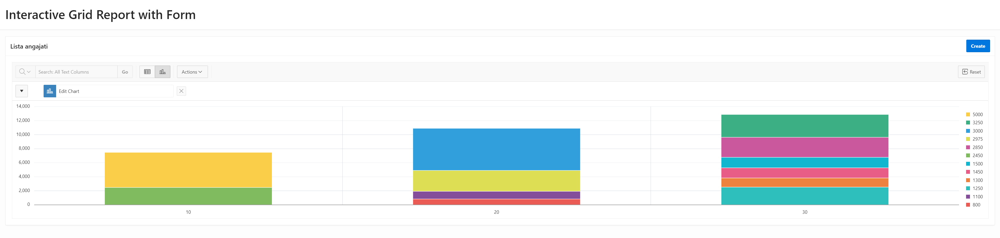

## Table of Contents

- [Lab 05](#lab-05)
  - [Ownership](#ownership)
  - [- Git URL for this lab](#--git-url-for-this-lab)
  - [**_NOTE_**: Please note that this repository is private. You need to provide me with your github account to provide you access.](#note-please-note-that-this-repository-is-private-you-need-to-provide-me-with-your-github-account-to-provide-you-access)
  - [Lab](#lab)
    - [Raport Interactiv cu Form](#raport-interactiv-cu-form)
      - [Script](#script)
      - [Cheie Primara](#cheie-primara)
      - [Generare](#generare)
      - [Date](#date)
      - [Excel](#excel)
    - [Raport Interactiv Grid cu Form](#raport-interactiv-grid-cu-form)
      - [DataSource](#datasource)
      - [Cheie Primara](#cheie-primara-1)
      - [Generare](#generare-1)
      - [Date](#date-1)
      - [Creare](#creare)
      - [Confirmare Creare](#confirmare-creare)
      - [Inainte de Editare](#inainte-de-editare)
      - [Editare](#editare)
      - [Confirmare Editare](#confirmare-editare)
      - [Inainte de Editare](#inainte-de-editare-1)
      - [Stergere](#stergere)
      - [Confirmare Stergere](#confirmare-stergere)
      - [Grafic](#grafic)


# Lab 05
## Ownership
- Student: Marius Vintila
- Group: 341C5
- [Git Repo](https://github.com/Mr-Vinti/SCAD_Labs)
- [Git URL for this lab](https://github.com/Mr-Vinti/SCAD_Labs/tree/master/05Lab)
---
**_NOTE_**: Please note that this repository is private. You need to provide me with your github account to provide you access.
---

---
## Lab

### Raport Interactiv cu Form
#### Script
```sql
SELECT
    DEPART_CASE.DEN_DEP AS "Denumire_dep",
    ANGAJATI_CASE.NUME AS "Nume_angajat",
    (
        SELECT
            AVG(ANGAJATI.SALARIU)
        FROM ANGAJATI_CASE ANGAJATI
        WHERE
            ANGAJATI.ID_DEP = ANGAJATI_CASE.ID_DEP
    ) AS "Sal_mediu_dep",
    ANGAJATI_CASE.FUNCTIE AS "Job",
    ANGAJATI_CASE.SALARIU AS "Salariu_ang"
 FROM
    ANGAJATI_CASE ANGAJATI_CASE,
    DEPART_CASE DEPART_CASE 
 WHERE
    DEPART_CASE.ID_DEP = ANGAJATI_CASE.ID_DEP
    AND ANGAJATI_CASE.SALARIU > (
        SELECT
            AVG(ANGAJATI.SALARIU)
        FROM ANGAJATI_CASE ANGAJATI
        WHERE
            ANGAJATI.ID_DEP = ANGAJATI_CASE.ID_DEP
    ) / 2;
```
#### Cheie Primara

#### Generare

#### Date

#### Excel


### Raport Interactiv Grid cu Form
#### DataSource

#### Cheie Primara

#### Generare

#### Date

#### Creare

#### Confirmare Creare

#### Inainte de Editare

#### Editare

#### Confirmare Editare

#### Inainte de Editare

#### Stergere

#### Confirmare Stergere

#### Grafic

