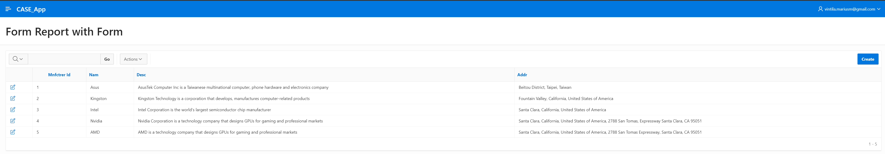
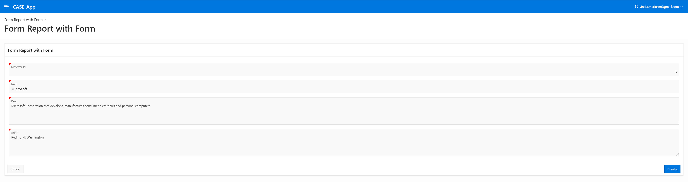
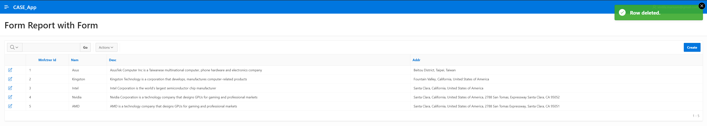

## Table of Contents

- [Lab 06](#lab-06)
  - [Ownership](#ownership)
  - [- Git URL for this lab](#--git-url-for-this-lab)
  - [**_NOTE_**: Please note that this repository is private. You need to provide me with your github account to provide you access.](#note-please-note-that-this-repository-is-private-you-need-to-provide-me-with-your-github-account-to-provide-you-access)
  - [Lab](#lab)
    - [Store initial import](#store-initial-import)
    - [Manufacturer initial import](#manufacturer-initial-import)
      - [Excel](#excel)
      - [Apex](#apex)
    - [Form Editable Interactive Grid](#form-editable-interactive-grid)
      - [Generare](#generare)
      - [Date](#date)
      - [Creare](#creare)
      - [Confirmare Creare](#confirmare-creare)
      - [Editare](#editare)
      - [Confirmare Editare](#confirmare-editare)
      - [Buton de Stergere](#buton-de-stergere)
      - [Stergere](#stergere)
      - [Confirmare Stergere](#confirmare-stergere)
    - [Form Report with Form](#form-report-with-form)
      - [Generare](#generare-1)
      - [Date](#date-1)
      - [Creare](#creare-1)
      - [Confirmare Creare](#confirmare-creare-1)
      - [Editare](#editare-1)
      - [Confirmare Editare](#confirmare-editare-1)
      - [Stergere](#stergere-1)
      - [Confirmare Stergere](#confirmare-stergere-1)

# Lab 06
## Ownership
- Student: Marius Vintila
- Group: 341C5
- [Git Repo](https://github.com/Mr-Vinti/SCAD_Labs)
- [Git URL for this lab](https://github.com/Mr-Vinti/SCAD_Labs/tree/master/06Lab)
---
**_NOTE_**: Please note that this repository is private. You need to provide me with your github account to provide you access.
---

---
## Lab

### Store initial import
- A fost facut ca si parte din prima etapa a proiectului. Verificati acel assignment

### Manufacturer initial import
#### Excel

#### Apex

### Form Editable Interactive Grid
- Am ales sa aplic acest form pe tabela STR - Store
#### Generare

#### Date

#### Creare

#### Confirmare Creare

#### Editare

#### Confirmare Editare

#### Buton de Stergere

#### Stergere

#### Confirmare Stergere

### Form Report with Form
- Am ales sa aplic acest form pe tabela MNFCTRER - Manufacturer
#### Generare

#### Date

#### Creare

#### Confirmare Creare

#### Editare

#### Confirmare Editare

#### Stergere

#### Confirmare Stergere

