## Table of Contents

- [Lab 07](#lab-07)
  - [Ownership](#ownership)
  - [- Git URL for this lab](#--git-url-for-this-lab)
  - [**_NOTE_**: Please note that this repository is private. You need to provide me with your github account to provide you access.](#note-please-note-that-this-repository-is-private-you-need-to-provide-me-with-your-github-account-to-provide-you-access)
  - [Lab](#lab)
    - [Master Detail Stacked](#master-detail-stacked)
      - [Master Source](#master-source)
      - [Detail Source](#detail-source)
      - [Adaugare Master & Detail](#adaugare-master--detail)
      - [Rezultat Adaugare (nu s-au afisat mesaje)](#rezultat-adaugare-nu-s-au-afisat-mesaje)
      - [Editare Detail](#editare-detail)
      - [Rezultat Editare Detail (nu s-au afisat mesaje)](#rezultat-editare-detail-nu-s-au-afisat-mesaje)
      - [Editare Master](#editare-master)
      - [Rezultat Editare Master (nu s-au afisat mesaje)](#rezultat-editare-master-nu-s-au-afisat-mesaje)
      - [Stergere Detail](#stergere-detail)
      - [Rezultat Stergere Detail (nu s-au afisat mesaje)](#rezultat-stergere-detail-nu-s-au-afisat-mesaje)
      - [Stergere Master](#stergere-master)
      - [Rezultat Stergere Master (nu s-au afisat mesaje)](#rezultat-stergere-master-nu-s-au-afisat-mesaje)

# Lab 07
## Ownership
- Student: Marius Vintila
- Group: 341C5
- [Git Repo](https://github.com/Mr-Vinti/SCAD_Labs)
- [Git URL for this lab](https://github.com/Mr-Vinti/SCAD_Labs/tree/master/07Lab)
---
**_NOTE_**: Please note that this repository is private. You need to provide me with your github account to provide you access.
---

---
## Lab

### Master Detail Stacked
- Am ales sa realizez un formular Master-Detail de tip Stacked intre tabelele MNFCTRER (Manufacturer) si PRDCT (Product)

#### Master Source
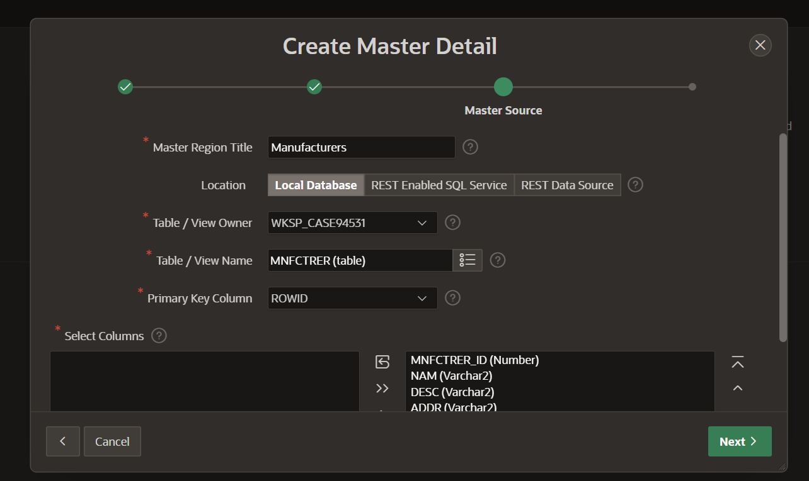
#### Detail Source
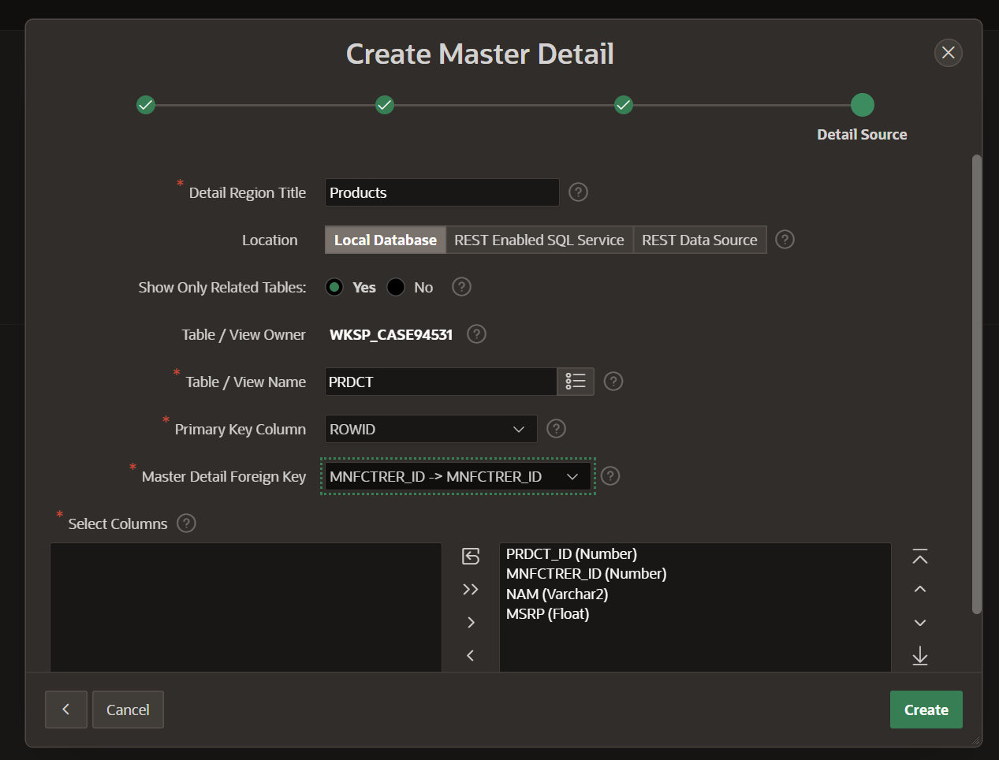
#### Adaugare Master & Detail
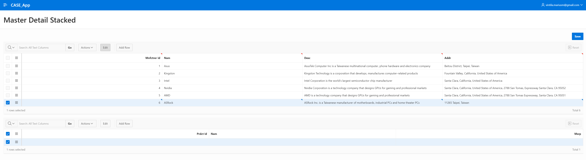

#### Rezultat Adaugare (nu s-au afisat mesaje)
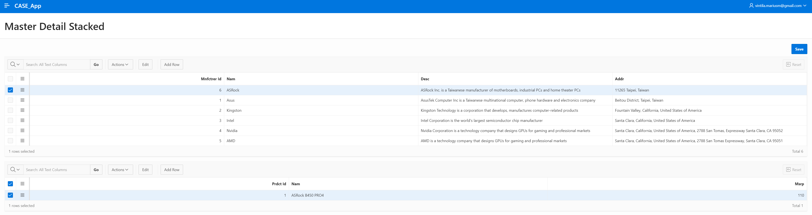
#### Editare Detail
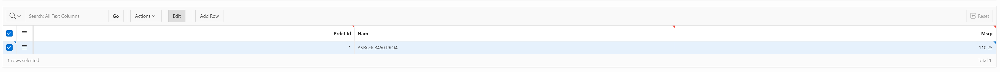
#### Rezultat Editare Detail (nu s-au afisat mesaje)
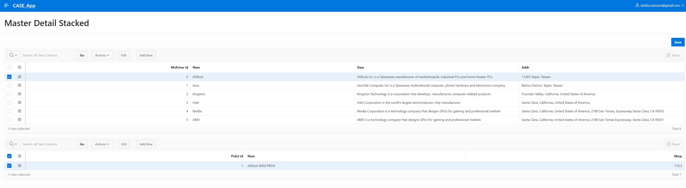
#### Editare Master
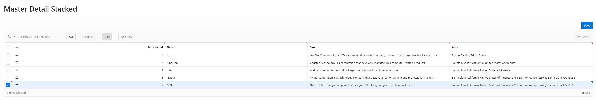
#### Rezultat Editare Master (nu s-au afisat mesaje)
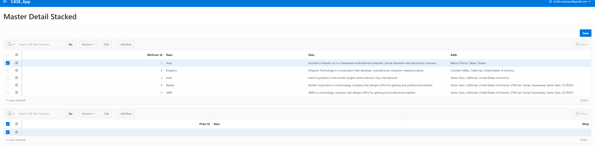
#### Stergere Detail
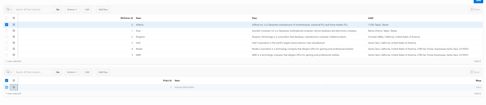
#### Rezultat Stergere Detail (nu s-au afisat mesaje)
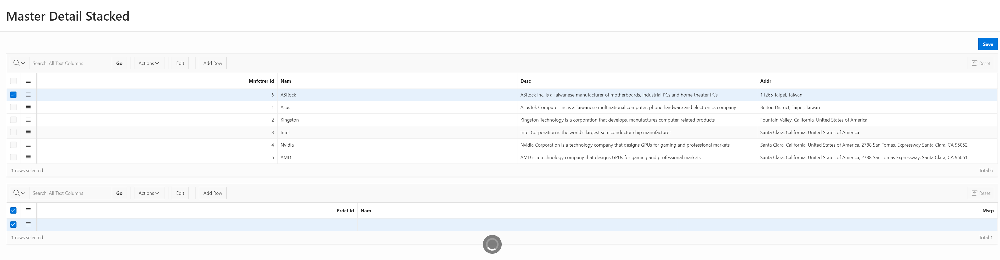
#### Stergere Master
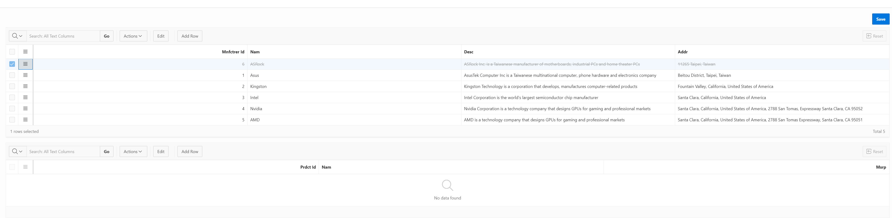
#### Rezultat Stergere Master (nu s-au afisat mesaje)
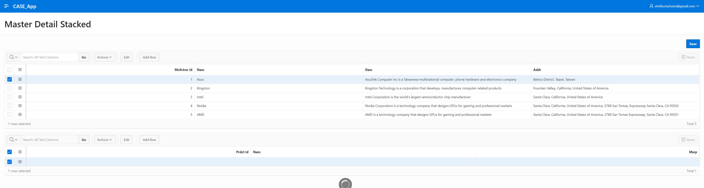
