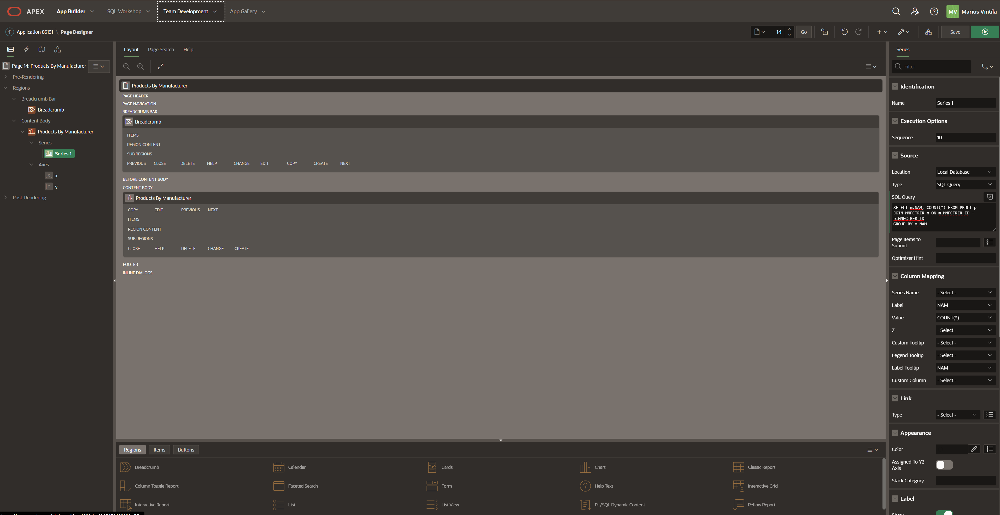
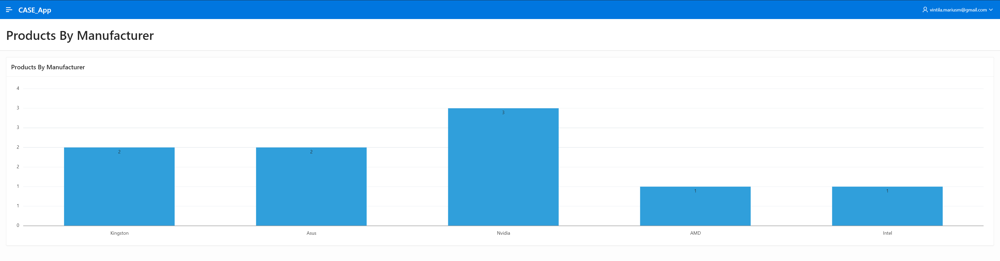
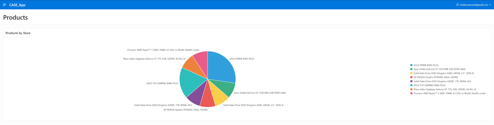

## Table of Contents

- [Lab 08](#lab-08)
  - [Ownership](#ownership)
  - [- Git URL for this lab](#--git-url-for-this-lab)
  - [**_NOTE_**: Please note that this repository is private. You need to provide me with your github account to provide you access.](#note-please-note-that-this-repository-is-private-you-need-to-provide-me-with-your-github-account-to-provide-you-access)
  - [Lab](#lab)
    - [XCASE Diagram](#xcase-diagram)
    - [First Chart](#first-chart)
      - [Query First Chart](#query-first-chart)
      - [Generare Chart](#generare-chart)
      - [Date Chart](#date-chart)
    - [Second Chart](#second-chart)
      - [Query Second Chart](#query-second-chart)
      - [Generare Chart](#generare-chart-1)
      - [Date Chart](#date-chart-1)


# Lab 08
## Ownership
- Student: Marius Vintila
- Group: 341C5
- [Git Repo](https://github.com/Mr-Vinti/SCAD_Labs)
- [Git URL for this lab](https://github.com/Mr-Vinti/SCAD_Labs/tree/master/08Lab)
---
**_NOTE_**: Please note that this repository is private. You need to provide me with your github account to provide you access.
---

---
## Lab

### XCASE Diagram


### First Chart
- Am ales sa realizez un chart de tip bar intre tabelele MNFCTRER (Manufacturer) si PRDCT (Product). Pentru fiecare manufacturer, voi afisa numarul de produse asociat

#### Query First Chart
```sql
SELECT m.NAM, COUNT(*) FROM PRDCT p
JOIN MNFCTRER m ON m.MNFCTRER_ID = p.MNFCTRER_ID
GROUP BY m.NAM
```

#### Generare Chart


#### Date Chart


### Second Chart
- Am ales sa realizez un chart de tip bar intre tabelele PRDCT (Product) si STR_PRDCT (Store Product). Pentru fiecare produs voi afisa in cate magazine se regaseste.

#### Query Second Chart
```sql
SELECT p.NAM, COUNT(*)
FROM PRDCT p
JOIN STR_PRDCT sp ON p.PRDCT_ID = sp.PRDCT_ID
GROUP BY p.NAM
```

#### Generare Chart


#### Date Chart

