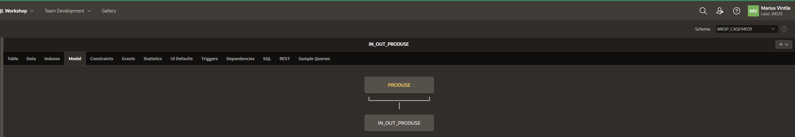
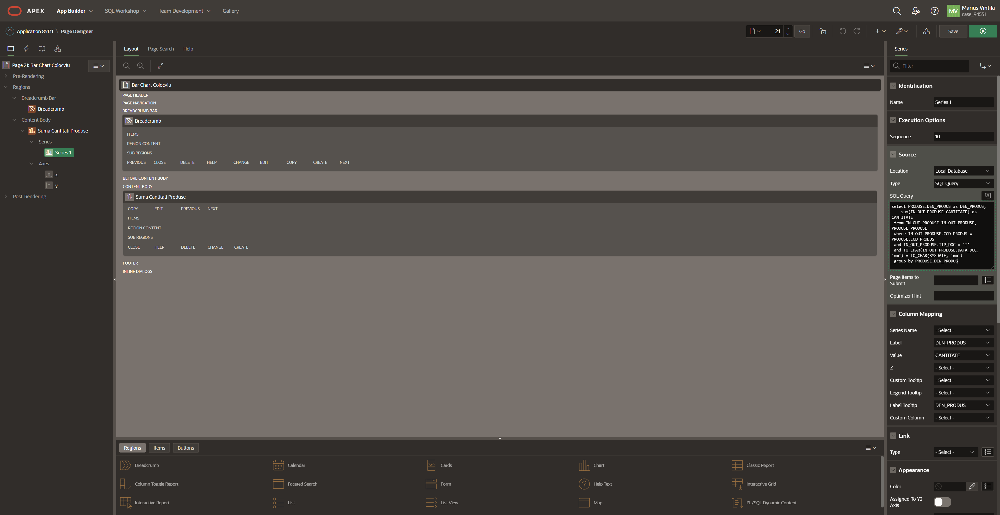

## Table of Contents

- [Colocviu](#colocviu)
  - [Ownership](#ownership)
  - [- Git URL for this lab](#--git-url-for-this-lab)
  - [**_NOTE_**: Please note that this repository is private. You need to provide me with your github account to provide you access.](#note-please-note-that-this-repository-is-private-you-need-to-provide-me-with-your-github-account-to-provide-you-access)
  - [XCASE Diagram](#xcase-diagram)
  - [XCASE Script](#xcase-script)
  - [Apex Tables](#apex-tables)
  - [Master Detail](#master-detail)
    - [Master Source](#master-source)
    - [Detail Source](#detail-source)
    - [Generare](#generare)
    - [Initial](#initial)
    - [Date](#date)
  - [Classic Report](#classic-report)
    - [Generare & Query Report](#generare--query-report)
    - [Date Report](#date-report)
  - [Bar Chart](#bar-chart)
    - [Generare & Query Chart](#generare--query-chart)
    - [Date Chart](#date-chart)


# Colocviu
## Ownership
- Student: Marius Vintila
- Group: 341C5
- [Git Repo](https://github.com/Mr-Vinti/SCAD_Labs)
- [Git URL for this lab](https://github.com/Mr-Vinti/SCAD_Labs/tree/master/Colocviu)
---
**_NOTE_**: Please note that this repository is private. You need to provide me with your github account to provide you access.
---

---

## XCASE Diagram


## XCASE Script
```sql
CREATE  TABLE PRODUSE
(
     COD_PRODUS NUMBER(10) NOT NULL ,
     DEN_PRODUS VARCHAR2(200) NOT NULL ,
     DATE_CATALOG VARCHAR2(500) NOT NULL      ,
     CONSTRAINT PK_PRODUSE PRIMARY KEY (COD_PRODUS) NOT DEFERRABLE Initially IMMEDIATE
     USING INDEX
     PCTFREE 10
     INITRANS 2
     MAXTRANS 255
     STORAGE
     (
       INITIAL 64K
       NEXT 0K
       MINEXTENTS 1
       MAXEXTENTS 2147483645
       PCTINCREASE 0
     )
)
     PCTFREE 10
     PCTUSED 40
     INITRANS 1
     MAXTRANS 255
     STORAGE
     (
       INITIAL 64K
       NEXT 0K
       MINEXTENTS 1
       MAXEXTENTS 2147483645
       PCTINCREASE 0
     )
/

CREATE  TABLE IN_OUT_PRODUSE
(
     COD_PRODUS NUMBER(10) NOT NULL ,
     NR_DOC NUMBER(10) NOT NULL ,
     DATA_DOC DATE NOT NULL ,
     CANTITATE NUMBER(10) NOT NULL ,
     UNIT_MASURA VARCHAR2(20) NOT NULL ,
     PRET_UNITAR FLOAT NOT NULL ,
     TIP_DOC CHAR(1) NOT NULL      ,
     CONSTRAINT PK_IN_OUT_PRODUSE PRIMARY KEY (COD_PRODUS,NR_DOC,DATA_DOC) NOT DEFERRABLE Initially IMMEDIATE
     USING INDEX
     PCTFREE 10
     INITRANS 2
     MAXTRANS 255
     STORAGE
     (
       INITIAL 64K
       NEXT 0K
       MINEXTENTS 1
       MAXEXTENTS 2147483645
       PCTINCREASE 0
     )
)
     PCTFREE 10
     PCTUSED 40
     INITRANS 1
     MAXTRANS 255
     STORAGE
     (
       INITIAL 64K
       NEXT 0K
       MINEXTENTS 1
       MAXEXTENTS 2147483645
       PCTINCREASE 0
     )
/

ALTER TABLE IN_OUT_PRODUSE ADD
(
     CONSTRAINT FK_PRODUSE_IN_OUT_PRODUSE FOREIGN KEY
     ( COD_PRODUS )
     REFERENCES PRODUSE
     ( COD_PRODUS )
     NOT DEFERRABLE Initially IMMEDIATE
)
/
```

## Apex Tables




## Master Detail

### Master Source


### Detail Source


### Generare


### Initial


### Date


## Classic Report

### Generare & Query Report


```sql
select PRODUSE.COD_PRODUS as "Cod_Produs",
    PRODUSE.DEN_PRODUS as "Denumire",
    IN_OUT_PRODUSE.NR_DOC as "Nr_Doc",
    IN_OUT_PRODUSE.DATA_DOC as "Data_doc",
    IN_OUT_PRODUSE.CANTITATE as "Cantitate",
    IN_OUT_PRODUSE.UNIT_MASURA as "Unit_Masura",
    IN_OUT_PRODUSE.PRET_UNITAR as "Pret_unitar"
 from IN_OUT_PRODUSE IN_OUT_PRODUSE,
    PRODUSE PRODUSE
 where PRODUSE.COD_PRODUS=IN_OUT_PRODUSE.COD_PRODUS
    and TO_CHAR(IN_OUT_PRODUSE.DATA_DOC, 'mm') = TO_CHAR(SYSDATE, 'mm')
    and IN_OUT_PRODUSE.TIP_DOC = 'I'
```

### Date Report


## Bar Chart

### Generare & Query Chart


```sql
select PRODUSE.DEN_PRODUS as DEN_PRODUS,
    sum(IN_OUT_PRODUSE.CANTITATE) as CANTITATE
 from IN_OUT_PRODUSE IN_OUT_PRODUSE, PRODUSE PRODUSE
 where IN_OUT_PRODUSE.COD_PRODUS = PRODUSE.COD_PRODUS
 and IN_OUT_PRODUSE.TIP_DOC = 'I'
 and TO_CHAR(IN_OUT_PRODUSE.DATA_DOC, 'mm') = TO_CHAR(SYSDATE, 'mm')
 group by PRODUSE.DEN_PRODUS
```

### Date Chart
