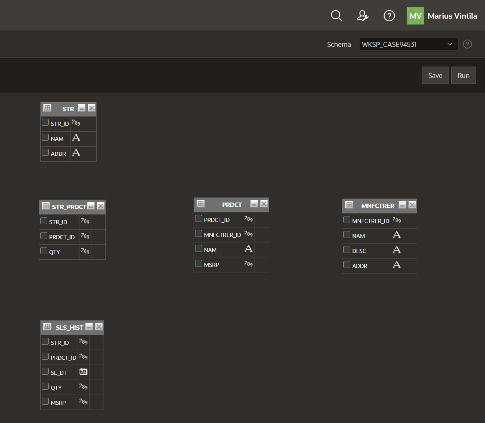
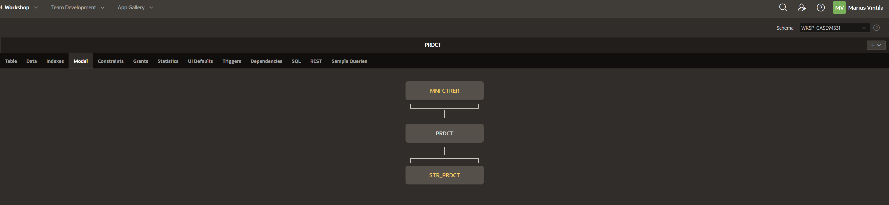
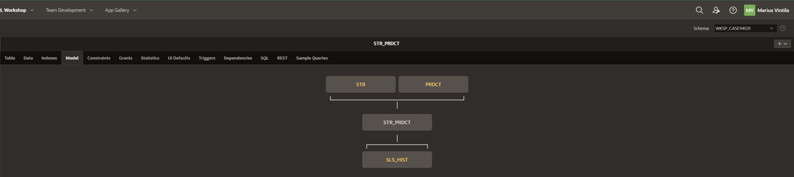
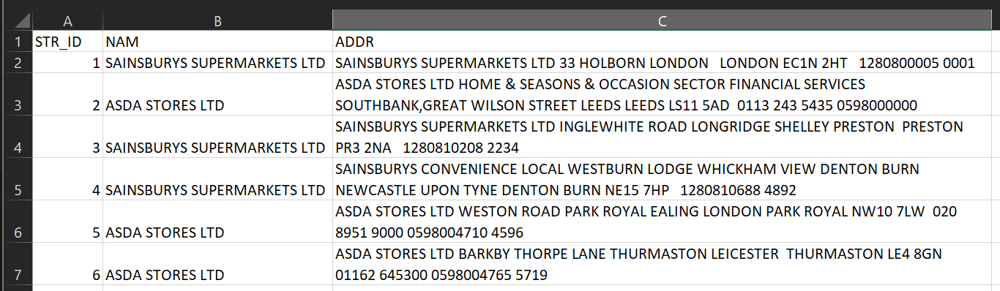
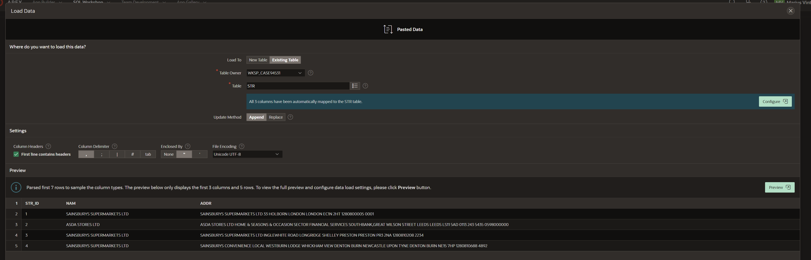
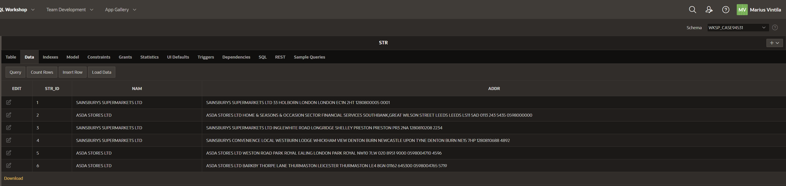

## Table of Contents

- [Project Stage 01](#project-stage-01)
  - [Ownership](#ownership)
  - [- Git URL for this lab](#--git-url-for-this-lab)
  - [**_NOTE_**: Please note that this repository is private. You need to provide me with your github account to provide you access.](#note-please-note-that-this-repository-is-private-you-need-to-provide-me-with-your-github-account-to-provide-you-access)
- [XCASE si descrierea modelului](#xcase-si-descrierea-modelului)
  - [XCASE Diagram](#xcase-diagram)
  - [Definirea structurilor tabelare](#definirea-structurilor-tabelare)
  - [Definirea si descrierea tabelelor](#definirea-si-descrierea-tabelelor)
  - [Relatiile Master-Detail](#relatiile-master-detail)
  - [Script](#script)
- [APEX](#apex)
  - [Structura tabelelor in APEX](#structura-tabelelor-in-apex)
  - [Data Load](#data-load)


# Project Stage 01
## Ownership
- Student: Marius Vintila
- Group: 341C5
- [Git Repo](https://github.com/Mr-Vinti/SCAD_Labs)
- [Git URL for this lab](https://github.com/Mr-Vinti/SCAD_Labs/tree/master/Project/01Stage)
---
**_NOTE_**: Please note that this repository is private. You need to provide me with your github account to provide you access.
---

---
# XCASE si descrierea modelului
## XCASE Diagram

## Definirea structurilor tabelare
In cadrul proiectului ales, _`Managementul componentelor de calculator dintr-un lant de magazine`_, am ales sa ma folosesc de urmatoarele structuri:
- STR: Store - Entitate folosita pentru a salva magazinele din lant
- MNFCTRER: Manufacturer - Entitate folosita pentru a salva producatorii de componente
- PRDCT: Product - Entitate folosita pentru a salva componentele de calculator
- STR_PRDCT: Store_Product - Entitate folosita pentru a salva produsele din fiecare magazin, impreuna cu cantitatea acestore
- SLS_HIST: Sales_History - Entitate folosita pentru a salva istoricul de vanzari al produselor pentru fiecare magazin

**_NOTE_** Din cauza faptului ca versiunea de XCASE oferita de dumneavoastra are o limitare de doar 5 entitati, a trebuit sa simplific ideea initiala

## Definirea si descrierea tabelelor
1. STR:
   - STR_ID (PK): Store_ID - Identificator unic corespunzator unui singur magazin
   - NAM, ADDR: Name, Address - Coloane ce memoreaza detalii despre magazin
2. MNFCTRER:
   - MNFCTRER_ID (PK): Manufacturer_ID - Identificator unic corespunzator unui singur producator
   - NAM, DESC, ADDR: Name, Description, Address - Coloane ce memoreaza detalii despre magazin
3. PRDCT:
   - PRDCT_ID (PK): Product_ID - Identificator unic corespunzator unui singur produs
   - MNFCTRER_ID (FK) - Fiecare produs apartine de un producator
   - NAM, MSRP: Name, Manufacturer's Suggested Retail Price - Coloane ce memoreaza detalii despre un produs
4. STR_PRDCT:
   - STR_ID, PRDCT_ID (PK, FK) - Cheie primara compusa pentru a asocia o entitate unui magazin si unui produs
   - QTY: Quantity - Cantitatea in care se regaseste produsul PRDCT_ID in magazinul STR_ID
5. SLS_HIST:
   - STR_ID, PRDCT_ID (PK, FK) - Cheie primara compusa pentru a asocia o entitate unui Store_Product
   - SL_DT (PK): Sale_Date - Data vanzarii produsului in magazin; Nu se pot vinde doua produse identice in acelasi magazin in aceeasi secunda
   - QTY, MSRP - Pretul si cantitatea cu care s-a vandut produsul la momentul respectiv

## Relatiile Master-Detail
1. Un Producator are mai multe produse, iar un produs apartine de un producator, intotdeauna
   - MNFCTRER - PRDCT
2. Un Magazin are mai multe produse, iar un produs poate exista in mai multe magazine, in cantitati diferite
   - STR - STR_PRDCT
   - PRDCT - STR_PRDCT
3. Un produs din cadrul unui magazin se poate vinde de mai multe ori, iar mai multe vanzari i se pot asocia unui produs si unui magazin
   - STR_PRDCT - SLS_HIST

## Script
```sql
CREATE  TABLE STR
( 
     STR_ID NUMBER(10) NOT NULL ,
     NAM VARCHAR2(50) NOT NULL ,
     ADDR VARCHAR2(200) NOT NULL      ,
     CONSTRAINT PK_STR PRIMARY KEY (STR_ID) NOT DEFERRABLE Initially IMMEDIATE
     USING INDEX
     PCTFREE 10
     INITRANS 2
     MAXTRANS 255
     STORAGE
     (
       INITIAL 64K
       NEXT 0K
       MINEXTENTS 1
       MAXEXTENTS 2147483645
       PCTINCREASE 0
     )
)
     PCTFREE 10
     PCTUSED 40
     INITRANS 1
     MAXTRANS 255
     STORAGE
     (
       INITIAL 64K
       NEXT 0K
       MINEXTENTS 1
       MAXEXTENTS 2147483645
       PCTINCREASE 0
     )
/

CREATE  TABLE PRDCT
( 
     PRDCT_ID NUMBER(10) NOT NULL ,
     MNFCTRER_ID NUMBER(10) NOT NULL ,
     NAM VARCHAR2(100) NOT NULL ,
     MSRP FLOAT(10) NOT NULL      ,
     CONSTRAINT PK_PRDCT PRIMARY KEY (PRDCT_ID) NOT DEFERRABLE Initially IMMEDIATE
     USING INDEX
     PCTFREE 10
     INITRANS 2
     MAXTRANS 255
     STORAGE
     (
       INITIAL 64K
       NEXT 0K
       MINEXTENTS 1
       MAXEXTENTS 2147483645
       PCTINCREASE 0
     )
)
     PCTFREE 10
     PCTUSED 40
     INITRANS 1
     MAXTRANS 255
     STORAGE
     (
       INITIAL 64K
       NEXT 0K
       MINEXTENTS 1
       MAXEXTENTS 2147483645
       PCTINCREASE 0
     )
/

CREATE  TABLE STR_PRDCT
( 
     STR_ID NUMBER(10) NOT NULL ,
     PRDCT_ID NUMBER(10) NOT NULL ,
     QTY NUMBER(10) NOT NULL      ,
     CONSTRAINT PK_STR_PRDCT PRIMARY KEY (STR_ID,PRDCT_ID) NOT DEFERRABLE Initially IMMEDIATE
     USING INDEX
     PCTFREE 10
     INITRANS 2
     MAXTRANS 255
     STORAGE
     (
       INITIAL 64K
       NEXT 0K
       MINEXTENTS 1
       MAXEXTENTS 2147483645
       PCTINCREASE 0
     )
)
     PCTFREE 10
     PCTUSED 40
     INITRANS 1
     MAXTRANS 255
     STORAGE
     (
       INITIAL 64K
       NEXT 0K
       MINEXTENTS 1
       MAXEXTENTS 2147483645
       PCTINCREASE 0
     )
/

CREATE  TABLE MNFCTRER
( 
     MNFCTRER_ID NUMBER(10) NOT NULL ,
     NAM VARCHAR2(50) NOT NULL ,
     "DESC" VARCHAR2(100) NOT NULL ,
     ADDR VARCHAR2(200) NOT NULL      ,
     CONSTRAINT PK_MNFCTRER PRIMARY KEY (MNFCTRER_ID) NOT DEFERRABLE Initially IMMEDIATE
     USING INDEX
     PCTFREE 10
     INITRANS 2
     MAXTRANS 255
     STORAGE
     (
       INITIAL 64K
       NEXT 0K
       MINEXTENTS 1
       MAXEXTENTS 2147483645
       PCTINCREASE 0
     )
)
     PCTFREE 10
     PCTUSED 40
     INITRANS 1
     MAXTRANS 255
     STORAGE
     (
       INITIAL 64K
       NEXT 0K
       MINEXTENTS 1
       MAXEXTENTS 2147483645
       PCTINCREASE 0
     )
/

CREATE  TABLE SLS_HIST
( 
     STR_ID NUMBER(10) NOT NULL ,
     PRDCT_ID NUMBER(10) NOT NULL ,
     SL_DT DATE NOT NULL ,
     QTY NUMBER(10) NOT NULL ,
     MSRP FLOAT(10) NOT NULL      ,
     CONSTRAINT PK_SLS_HIST PRIMARY KEY (STR_ID,PRDCT_ID,SL_DT) NOT DEFERRABLE Initially IMMEDIATE
     USING INDEX
     PCTFREE 10
     INITRANS 2
     MAXTRANS 255
     STORAGE
     (
       INITIAL 64K
       NEXT 0K
       MINEXTENTS 1
       MAXEXTENTS 2147483645
       PCTINCREASE 0
     )
)
     PCTFREE 10
     PCTUSED 40
     INITRANS 1
     MAXTRANS 255
     STORAGE
     (
       INITIAL 64K
       NEXT 0K
       MINEXTENTS 1
       MAXEXTENTS 2147483645
       PCTINCREASE 0
     )
/

ALTER TABLE PRDCT ADD
(
     CONSTRAINT FK_MNFCTRER_PRDCT FOREIGN KEY
     ( MNFCTRER_ID )
     REFERENCES MNFCTRER
     ( MNFCTRER_ID )
     NOT DEFERRABLE Initially IMMEDIATE
)
/

ALTER TABLE STR_PRDCT ADD
(
     CONSTRAINT FK_PRDCT_STR_PRDCT FOREIGN KEY
     ( PRDCT_ID )
     REFERENCES PRDCT
     ( PRDCT_ID )
     NOT DEFERRABLE Initially IMMEDIATE
)
/

ALTER TABLE STR_PRDCT ADD
(
     CONSTRAINT FK_STR_STR_PRDCT FOREIGN KEY
     ( STR_ID )
     REFERENCES STR
     ( STR_ID )
     NOT DEFERRABLE Initially IMMEDIATE
)
/

ALTER TABLE SLS_HIST ADD
(
     CONSTRAINT FK_STR_PRDCT_SLS_HIST FOREIGN KEY
     ( STR_ID , PRDCT_ID )
     REFERENCES STR_PRDCT
     ( STR_ID , PRDCT_ID )
     NOT DEFERRABLE Initially IMMEDIATE
)
/


```

# APEX

In APEX, am importat fiecare comanda din script-ul de mai sus folosind tool-ul SQL Commands, astfel generand toate cele 5 tabele si relatiile dintre ele

## Structura tabelelor in APEX
Am folosit Tool-ul Query Builder pentru a afisa toate cele 5 tabele in acelasi timp:


De asemenea, se pot observa relatiile dintre tabele in Object Browser, pe tab-ul de Model:



## Data Load
Pentru adaugarea de date, am creat un fisier CSV pe care l-am importat in tabela STR




Am repetat procedeul si pentru restul tabelelor.