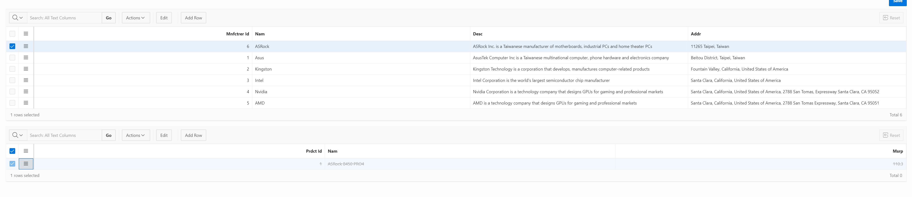

## Table of Contents

- [Project Final Stage](#project-final-stage)
  - [Ownership](#ownership)
  - [- Git URL for this lab](#--git-url-for-this-lab)
  - [**_NOTE_**: Please note that this repository is private. You need to provide me with your github account to provide you access.](#note-please-note-that-this-repository-is-private-you-need-to-provide-me-with-your-github-account-to-provide-you-access)
- [XCASE si descrierea modelului](#xcase-si-descrierea-modelului)
  - [XCASE Diagram](#xcase-diagram)
- [Formulare simple](#formulare-simple)
  - [Form Editable Interactive Grid](#form-editable-interactive-grid)
    - [Generare](#generare)
    - [Date](#date)
    - [Creare](#creare)
    - [Confirmare Creare](#confirmare-creare)
    - [Editare](#editare)
    - [Confirmare Editare](#confirmare-editare)
    - [Buton de Stergere](#buton-de-stergere)
    - [Stergere](#stergere)
    - [Confirmare Stergere](#confirmare-stergere)
  - [Form Report with Form](#form-report-with-form)
    - [Generare](#generare-1)
    - [Date](#date-1)
    - [Creare](#creare-1)
    - [Confirmare Creare](#confirmare-creare-1)
    - [Editare](#editare-1)
    - [Confirmare Editare](#confirmare-editare-1)
    - [Stergere](#stergere-1)
    - [Confirmare Stergere](#confirmare-stergere-1)
- [Formulare Master Detail](#formulare-master-detail)
  - [Master Detail Stacked](#master-detail-stacked)
    - [Master Source](#master-source)
    - [Detail Source](#detail-source)
    - [Adaugare Master & Detail](#adaugare-master--detail)
    - [Rezultat Adaugare (nu s-au afisat mesaje)](#rezultat-adaugare-nu-s-au-afisat-mesaje)
    - [Editare Detail](#editare-detail)
    - [Rezultat Editare Detail (nu s-au afisat mesaje)](#rezultat-editare-detail-nu-s-au-afisat-mesaje)
    - [Editare Master](#editare-master)
    - [Rezultat Editare Master (nu s-au afisat mesaje)](#rezultat-editare-master-nu-s-au-afisat-mesaje)
    - [Stergere Detail](#stergere-detail)
    - [Rezultat Stergere Detail (nu s-au afisat mesaje)](#rezultat-stergere-detail-nu-s-au-afisat-mesaje)
    - [Stergere Master](#stergere-master)
    - [Rezultat Stergere Master (nu s-au afisat mesaje)](#rezultat-stergere-master-nu-s-au-afisat-mesaje)
  - [Master Detail Stacked 2](#master-detail-stacked-2)
    - [Master Source 2](#master-source-2)
    - [Detail Source 2](#detail-source-2)
    - [Adaugare Master & Detail 2](#adaugare-master--detail-2)
    - [Rezultat Adaugare 2 (nu s-au afisat mesaje)](#rezultat-adaugare-2-nu-s-au-afisat-mesaje)
    - [Stergere 2](#stergere-2)
    - [Rezultat Stergere 2 (nu s-au afisat mesaje)](#rezultat-stergere-2-nu-s-au-afisat-mesaje)
- [Rapoarte](#rapoarte)
  - [Classic Report](#classic-report)
    - [Generare Raport Clasic](#generare-raport-clasic)
    - [Date Raport Clasic](#date-raport-clasic)
  - [Interactive Report](#interactive-report)
    - [Generare Raport Interactiv](#generare-raport-interactiv)
    - [Date Raport Interactiv](#date-raport-interactiv)
- [Grafice](#grafice)
  - [Bar Chart](#bar-chart)
    - [Generare Bar Chart](#generare-bar-chart)
    - [Date Bar Chart](#date-bar-chart)

# Project Final Stage
## Ownership
- Student: Marius Vintila
- Group: 341C5
- [Git Repo](https://github.com/Mr-Vinti/SCAD_Labs)
- [Git URL for this lab](https://github.com/Mr-Vinti/SCAD_Labs/tree/master/Project/FinalStage)
---
**_NOTE_**: Please note that this repository is private. You need to provide me with your github account to provide you access.
---

---
# XCASE si descrierea modelului
## XCASE Diagram
- Diagrama nu a fost modificata de la etapa anterioara

# Formulare simple
## Form Editable Interactive Grid
- Am ales sa aplic acest form pe tabela STR - Store
### Generare

### Date

### Creare

### Confirmare Creare

### Editare

### Confirmare Editare

### Buton de Stergere

### Stergere

### Confirmare Stergere

## Form Report with Form
- Am ales sa aplic acest form pe tabela MNFCTRER - Manufacturer
### Generare

### Date

### Creare

### Confirmare Creare

### Editare

### Confirmare Editare

### Stergere

### Confirmare Stergere

# Formulare Master Detail
## Master Detail Stacked
- Am ales sa realizez un formular Master-Detail de tip Stacked intre tabelele MNFCTRER (Manufacturer) si PRDCT (Product)

### Master Source

### Detail Source

### Adaugare Master & Detail

### Rezultat Adaugare (nu s-au afisat mesaje)

### Editare Detail

### Rezultat Editare Detail (nu s-au afisat mesaje)

### Editare Master

### Rezultat Editare Master (nu s-au afisat mesaje)

### Stergere Detail

### Rezultat Stergere Detail (nu s-au afisat mesaje)

### Stergere Master

### Rezultat Stergere Master (nu s-au afisat mesaje)

## Master Detail Stacked 2
- Am ales sa realizez un formular Master-Detail de tip Stacked intre tabelele STR (Store) si STR_PRDCT (Store Product)

### Master Source 2

### Detail Source 2

### Adaugare Master & Detail 2

### Rezultat Adaugare 2 (nu s-au afisat mesaje)

### Stergere 2

### Rezultat Stergere 2 (nu s-au afisat mesaje)

# Rapoarte

## Classic Report
- Am ales sa fac un raport clasic pentru tabela PRDCT, pentru a vedea produsele cu pretul de peste 10 uom

### Generare Raport Clasic

### Date Raport Clasic

## Interactive Report
- Am ales sa fac un raport interactiv pentru tabela STR_PRDCT, pentru a vedea stocul de produse din magazine care au o cantitate de mai mult sau egal cu 5

### Generare Raport Interactiv

### Date Raport Interactiv

# Grafice

## Bar Chart
- Am ales sa fac un grafic de tip bar pentru tabela STR_PRDCT, pentru a vedea suma cantitatilor produselor din magazine pentru produsele care au o cantitate de mai mult sau egal cu 5, in functie de producatori

### Generare Bar Chart

### Date Bar Chart

